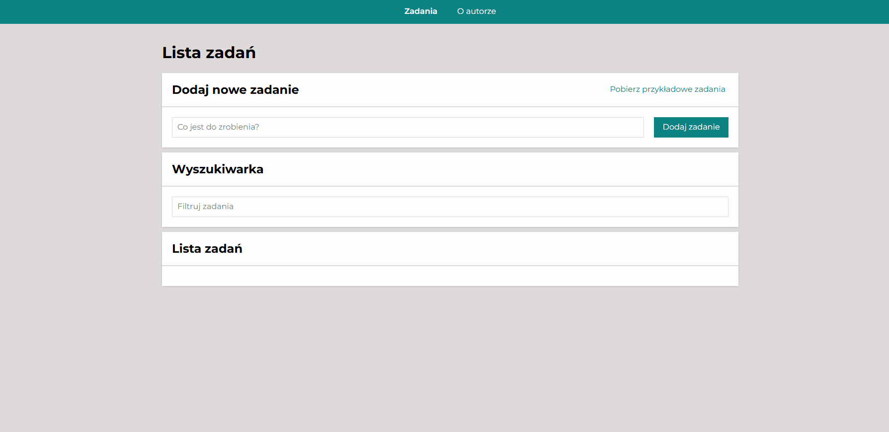

# 🧾 Task List

## 📖 Description

Hello! 
I would like to present a simple task list application. This application is easy and intuitive. Just write in the field what you have to do and then press the “add task” button or “enter” on the keyboard. Below you will see the typed tasks. You can mark them as completed or uncompleted (green button) or delete them (red button). 
There are also two additional buttons - the first shows the completed task and the second marks all tasks as completed.

Below is the presentation, link to the application, used technologies and available scripts.

## 🎬 Presentation

## 📄 Demo

https://am97veb.github.io/todos-list-react/

## ⚙ Technologies

This project was bootstrapped with [Create React App](https://github.com/facebook/create-react-app) and uses technologies implemented in Java Script ECMAScript 6. In addition, tools such as:

- Redux,
- Redux-Saga
- React Router
- Grid,
- Styled Components,
- ThemeProvider,
- Media Queries,
- Normalize.css,
- BEM convention.
    
## 📃 Available Scripts

In the project directory, you can run:

### `npm start`

Runs the app in the development mode.\
Open [http://localhost:3000](http://localhost:3000) to view it in your browser.

The page will reload when you make changes.\
You may also see any lint errors in the console.

### `npm run build`

Builds the app for production to the `build` folder.\
It correctly bundles React in production mode and optimizes the build for the best performance.

The build is minified and the filenames include the hashes.\
Your app is ready to be deployed!

See the section about [deployment](https://facebook.github.io/create-react-app/docs/deployment) for more information.

### `npm run eject`

**Note: this is a one-way operation. Once you `eject`, you can't go back!**

If you aren't satisfied with the build tool and configuration choices, you can `eject` at any time. This command will remove the single build dependency from your project.

Instead, it will copy all the configuration files and the transitive dependencies (webpack, Babel, ESLint, etc) right into your project so you have full control over them. All of the commands except `eject` will still work, but they will point to the copied scripts so you can tweak them. At this point you're on your own.

You don't have to ever use `eject`. The curated feature set is suitable for small and middle deployments, and you shouldn't feel obligated to use this feature. However we understand that this tool wouldn't be useful if you couldn't customize it when you are ready for it.